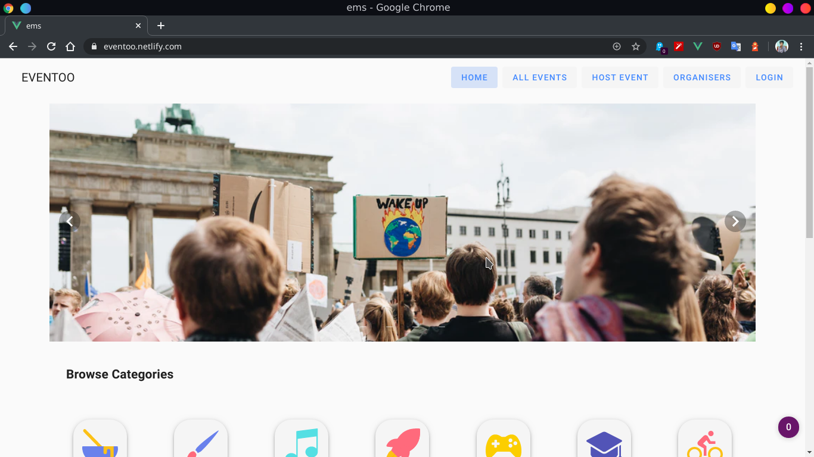
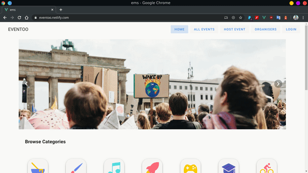

# Event Management System
A Event Management System for managing events happening around us. Best suitable for Universities. 



# Built With
<a href="https://vuejs.org/"></a> <a href="_https://firebase.google.com/"></a> 


>Before running this you have to build node modules. 

>For node modules install <a href="https://www.npmjs.com/package/npm-check" >npm-check</a>

after that

### Project setup, Compiles and hot-reloads for development
```
npm run serve
```

### Compiles and minifies for production
```
npm run build
```

### Customize configuration
See [Configuration Reference](https://cli.vuejs.org/config/).

# Demo
See at [Eventoo](https://eventoo.netlify.com/).

# Preview


